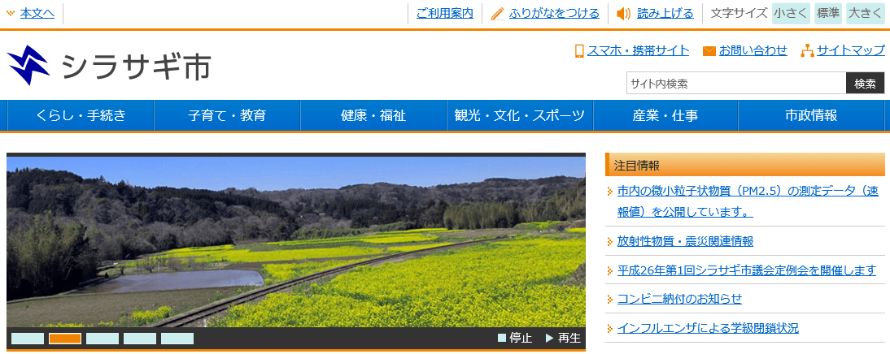

SHIRASAGI ハンズオン リポジトリ
=========

[SHIRASAGI](https://github.com/shirasagi/shirasagi)ハンズオンで使用するリポジトリです。 
開発環境構築手順、[コマンド集](Commandlist.txt)などを載せています。

## 開発環境構築手順

本リポジトリでは SHIRASAGI 開発環境一式を収めた Vagrant Box を提供しています。導入手順を解説します。

Vagrant Box を用いずに手動で開発環境を構築したい方は、[開発マニュアル](http://shirasagi.github.io/)の[手動インストール](http://shirasagi.github.io/installation/manual.html)を参考に、開発環境を構築してください。

開発環境を構築に不明な点があれば、[Facebook 開発グループ](https://www.facebook.com/groups/ssproj/?ref=bookmarks)または[Gitter](https://gitter.im/shirasagi/shirasagi)で質問を受け付けています。

### 前提条件

Vagrant Box を使う上で、いくつか前提条件があります。

* Windows をお使いの方
  * BIOS で Intel VT/AMD-V が有効になっていることを確認してください。
  * 標準で SSH クライアントがインストールされていないので、TeraTerm などを別途インストールしてください。
* Mac をお使いの方
  * 特にありません。問題なく Vagrant Box をお使いいただけます。

### VirtualBox と Vagrant のインストール

Vagrant Box を使用するには、別途 VirtualBox と Vagrant のインストールが必要です。それぞれ以下の場所からダウンロードし、インストールしてください。

* VirtualBox: [VirtualBox Download](https://www.virtualbox.org/wiki/Downloads)
* Vagrant: [Vagrant Download](http://www.vagrantup.com/downloads.html)

### Vagrant Box のインストール

適当なディレクトリを作成し、次のような内容を持つ  Vagrantfile  を作成してください。

    $ mkdir ss-handson
    $ cd ss-handson
    $ cat Vagrantfile
    VAGRANTFILE_API_VERSION = "2"
    Vagrant.configure(VAGRANTFILE_API_VERSION) do |config|
      config.vm.box = "ss-vagrant-v0.9.5"
      config.vm.box_url = "https://github.com/shirasagi/ss-vagrant/releases/download/v0.9.5/ss-vagrant-virtualbox-x86_64.box"
      config.vm.network :forwarded_port, guest: 3000, host: 3000

      config.vm.provider :virtualbox do |vb|
        # see: http://blog.shibayu36.org/entry/2013/08/12/090545
        # IPv6 と DNS でのネットワーク遅延対策で追記
        vb.customize ["modifyvm", :id, "--natdnsproxy1", "off"]
        vb.customize ["modifyvm", :id, "--natdnshostresolver1", "off"]
      end
    end

次のコマンドで起動できます。

    $ vagrant up

5 分から 10 分ぐらいかかるので、コーヒーでも飲みながら待ってください。

起動したら ssh クライアントでログインしてください。

* host: localhost
* port: 2222
* user: vagrant
* password: vagrant

SHIRASAGI ハンズオン用 Vagrant Box には、SHIRASAGI が `/vagrant/home` にインストールされています。

    $ tree -L 2 /vagrant/home
    /home/vagrant
    `-- shirasagi
        |-- app
        |-- bin
        |-- config
        |-- config.ru
        |-- db
        |-- doc
        |-- Gemfile
        |-- Gemfile.lock
        |-- Guardfile
        |-- lib
        |-- MIT-LICENSE
        |-- private
        |-- public
        |-- Rakefile
        |-- README.md
        |-- spec
        `-- vendor

SHIRASAGI を起動してみましょう。

    $ cd $HOME/shirasagi
    $ bundle exec rake unicorn:start
    bundle exec unicorn_rails -c /home/vagrant/shirasagi/config/unicorn.rb -E production -D

ブラウザで "http://localhost:3000/" にアクセスしてみましょう。 次のような画面が表示された成功です。

## コマンド集

ハンズオンで使用する[コマンド集](Commandlist.txt)をダウンロードし、
手元に置いておくと便利です。

事前にダウンロードしておいてください。

## 参考

* [開発マニュアル](http://shirasagi.github.io/)
