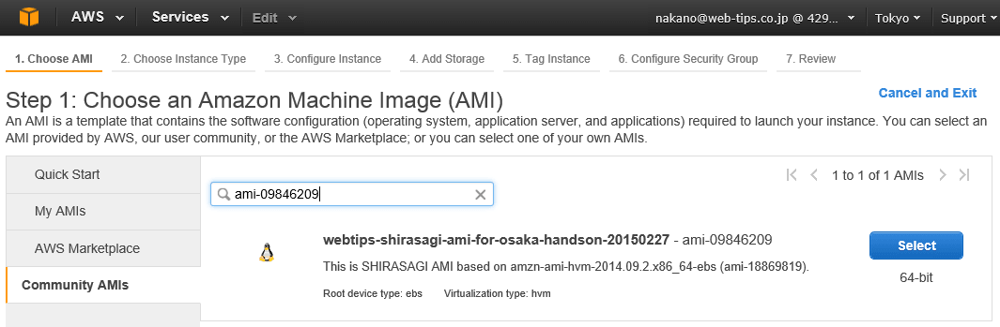

松江 SHIRASAGI ハンズオン用 AMI
===

松江 SHIRASAGI ハンズオン用 AMIを公開します。

    Id: ami-74302c75
    Name: webtips-shirasagi-ami-for-matsue-handson-20150130

## 使用方法

1. AWS Management Console にログインし、Instance を作成します。
2. 「Choose AMI」が表示されたら、左側の Community AMI をクリックします。
3. "ami-74302c75" を検索すると、webtips-shirasagi-ami-for-matsue-handson-20150130 が表示されます。

表示された AMI の "Select" をクリックし、画面の指示にしたがって Instance を作成してください。

## ログイン

ログイン ユーザ Id は `ec2-user` です。
プライベート・キーを使用してログインしてください。

## 補足

* 本 AMI は、`amzn-ami-hvm-2014.09.1.x86_64-ebs (ami-4985b048).` を元にして作成しています。
* Ruby 2.1.2 を ec2-user の Home に rvm を使用してインストールしています。
* MongoDB をインストールしています。
* ハンズオン終了後 AMI は削除します。
