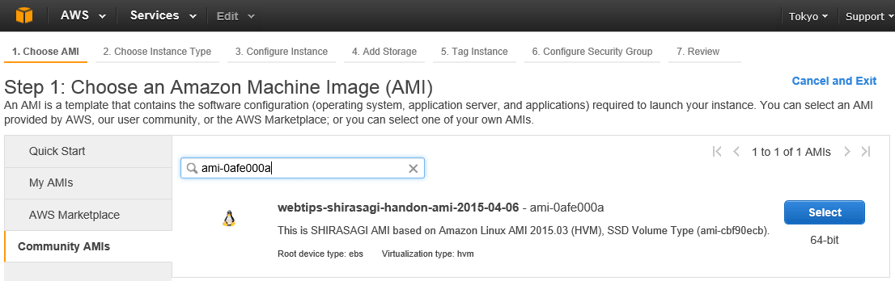

東京 SHIRASAGI ハンズオン用 AMI
===

東京 SHIRASAGI ハンズオン用 AMIを公開します。

    Id: ami-0afe000a
    Name: webtips-shirasagi-handon-ami-2015-04-06
    Region: Tokyo (ap-northeast-1)

## 使用方法

1. AWS Management Console にログインし、Instance を作成します。
2. 「Choose AMI」が表示されたら、左側の Community AMI をクリックします。
3. "ami-0afe000a" を検索すると、webtips-shirasagi-handon-ami-2015-04-06 が表示されます。

表示された AMI の "Select" をクリックし、画面の指示にしたがって Instance を作成してください。

## ログイン

ログイン ユーザ Id は `ec2-user` です。
プライベート・キーを使用してログインしてください。

## 補足

* 本 AMI は、`Amazon Linux AMI 2015.03 (HVM), SSD Volume Type (ami-cbf90ecb)` を元にして作成しています。
* RVM を /usr/local/rvm にインストールした後で、Ruby 2.2.1p85 をインストールしています。
* MongoDB 2.6.9 をインストールしています。
* ハンズオン終了後 AMI は削除します。

